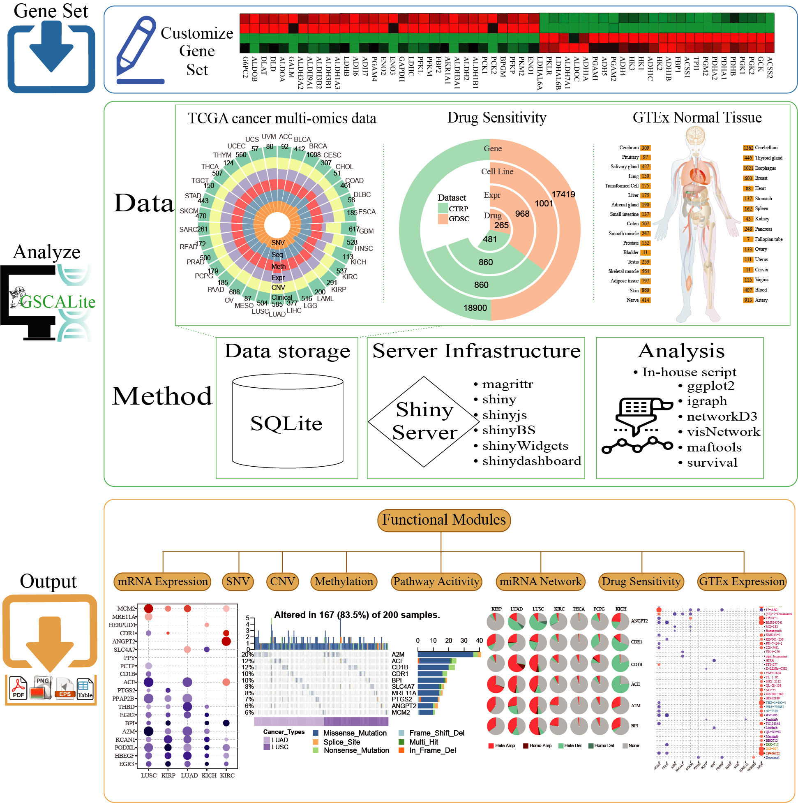

# GSCALite

## Citation
[GSCALite: A Web Server for Gene Set Cancer Analysis.](https://academic.oup.com/bioinformatics/advance-article/doi/10.1093/bioinformatics/bty411/5001392) Chun-Jie Liu,  Fei-Fei Hu,  Mengxuan Xia,  Leng Han,  Qiong Zhang,  An-Yuan Guo. Bioinformatics. (2018).

## Summary
The availability of cancer genomic data makes it possible to analyze genes related to cancer. Cancer is usually the result of a set of genes and the signal of a single gene could be covered by background noise. Here, we present a web server named Gene Set Cancer Analysis (GSCALite) to analyze a set of genes in cancers with the following functional modules. (i) Differential expression in tumor vs normal, and the survival analysis; (ii) Genomic variations and their survival analysis; (iii) Gene expression associated cancer pathway activity; (iv) miRNA regulatory network for genes; (v) Drug sensitivity for genes; (vi) Normal tissue expression and eQTL for genes. GSCALite is a user-friendly web server for dynamic analysis and visualization of gene set in cancer and drug sensitivity correlation, which will be of broad utilities to cancer researchers.

## Platform Logo

## The workflow of GSCALite

